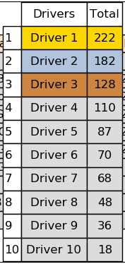
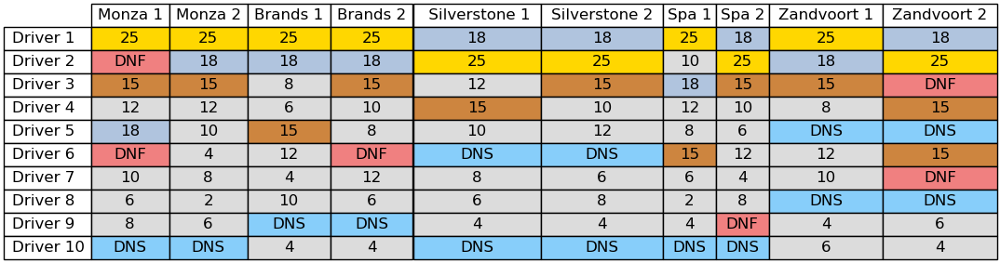
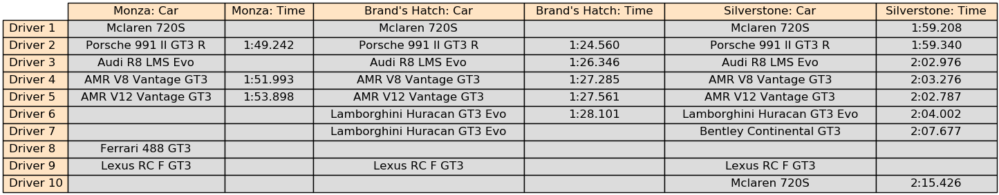
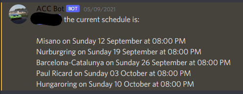

# ACC Discord Information Bot

#### Discord Bot for an Assetto Corsa Competizione league.

The aims starting out were as follows:
- [ ] To automatically announce when scheduled races are happening.
- [x] To display the schedule of upcoming races, and any additional information.
- [x] To give summaries of the positions in each race.
- [x] To give the overall drivers' standings.
- [x] To give best lap times (overall and per driver).
- [ ] To automatically pull race data from ACC dedicated server.
- [ ] Other fun ideas.


Used the Discord API and Google Spreadsheet API through the discord.py and gspread.py modules. This gave the ability to pull commands from specific dedicated channels in Discord and return valuable race information. The application is able to pull live data from a master Google Spreadsheet record and convert it to clear tables using Matplotlib. The spreadsheet was converted to a dictionary format and all transformations were applied using pandas' DataFrame object. Discord and Google tokens are required in a "Tokens" directory. This directory must contain two json files: one containing the private Google API keys and another containing the Discord API key. Structure of the Discord JSON is given below.

```json
{
    "ADMIN_ROLES": [
	"000000000000000001"
    ],
    "DISCORD_CHANNELS": [
        "000000000000000001",
        "000000000000000002"
    ],
    "DISCORD_SERVER": [
        "Server_Name"
    ],
    "DISCORD_TOKEN": "12345678901234567890",
    "GOOGLE_TOKEN_NAME" : "Name_of_file_containing_Google_API_key.json",
    "GOOGLE_SHEET": "Google_Sheet_Name",
    "KEKW_USER_ID": [
        "000000000000000001",
        "000000000000000002",
        "000000000000000003"
    ],
    "RESULTS_IMAGES": {
        "CurrentStandings.png" : "YYYY-MM-DD-HH:MM:SS",
        "RaceResults.png" : "YYYY-MM-DD-HH:MM:SS",
        "BestTimes.png" : "YYYY-MM-DD-HH:MM:SS"
    },
    "SCHEDULE" : {
        "Misano" : "YYYY-MM-DD-HH:MM:SS",
        "Nurburgring" : "YYYY-MM-DD-HH:MM:SS",
        "Barcelona-Catalunya" : "YYYY-MM-DD-HH:MM:SS",
        "Paul Ricard" : "YYYY-MM-DD-HH:MM:SS",
        "Hungaroring" : "YYYY-MM-DD-HH:MM:SS"
    }
}
```

---
#### Discord Commands
- !standings -> Drivers' Standings
- !raceresults -> Race Results
- !times -> Best Lap Times
- !schedule -> Upcoming Schedule
- !update -> Update the figures from the master record (Admin Only)
- !help -> Help command

---
#### Drivers' Standings
The drivers' standings were sorted according to the total number of points, where the top three were coloured gold, silver and bronze respectively. The positions and driver names were plotted alongside for clarity. Called by using the !standings command in Discord.


---
#### Race Results
Individual race results for each session. Each cell indicates the number of points awarded for that position. P1 is coloured gold, P2 is silver, P3 is bronze and all others are grey. Any DNF or DNS are coloured and give 0 points towards the total standings. Called by the !raceresults command.


---
#### Best Lap Times 
The best lap times for each driver on each track. This is voluntary information until the application can pull data directly from the server session information. Displays what car each driver used and what time they achieved. TODO: Implement purple colouring for fastest lap time. Called by the !times command.


---
#### Upcoming Schedule
Displays the upcoming schedule defined in the input json file.



## Python Dependencies
Required modules for Bot.py:
- os
- json
- discord
- datetime
- ACC_CustomCommands

Required modules for ACC_CustomCommands:
- gspread
- pandas
- oauth2client.service_account.ServiceAccountCredentials
- matplotlib.pyplot
- matplotlib.transforms.Bbox
- numpy